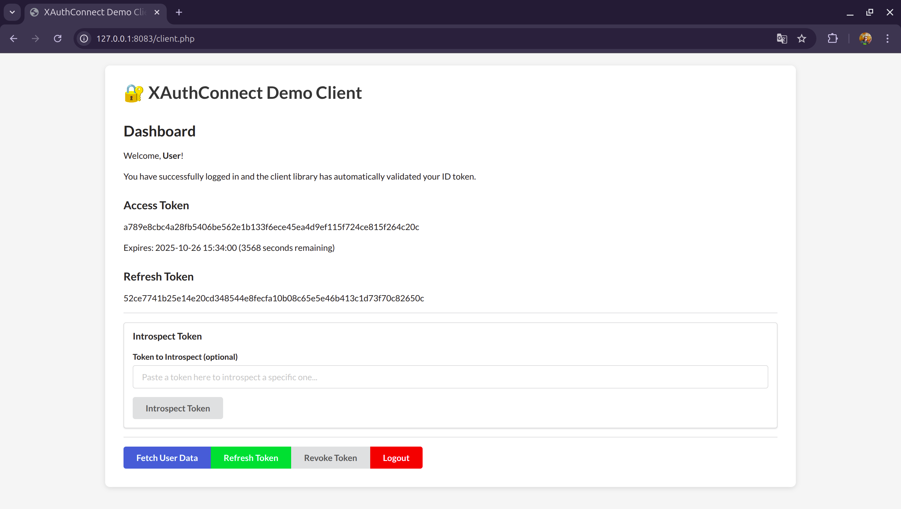

# XAuthConnect PHP Demo Client

This is a demonstration of the [oauth2-xauthconnect](https://github.com/newlandpe/oauth2-xauthconnect) library, a robust OAuth 2.0 client implementation for PHP. This demo showcases integration with an XAuthConnect authorization server, leveraging the library for streamlined authentication and authorization flows, including OIDC Discovery.



## Features

- **OAuth 2.0 Authorization Code Flow** with PKCE (Proof Key for Code Exchange)
- **Token Management**: Access token, refresh token with automatic refresh
- **Complete Token Operations**:
  - Token refresh
  - Token introspection
  - Token revocation
  - User data retrieval
- **Session Management**: Automatic token validation and recovery
- **User-Friendly Interface**: Semantic UI-based responsive design

## Requirements

- PHP 7.4 or higher
- PHP extensions: `curl`, `json`, `session`
- XAuthConnect server running (default: `http://127.0.0.1:8010`)
- [Composer](https://getcomposer.org/)

## Installation

To get started with the demo client, follow these steps:

1. Clone this repository:
```bash
git clone https://github.com/newlandpe/xauthconnect-php-demo-client.git
cd xauthconnect-php-demo-client
```

2. Install the dependencies using Composer:
```bash
composer require newlandpe/oauth2-xauthconnect
```

3. Configure the client by editing the `clientId`, `clientSecret`, `redirectUri`, and `issuer` parameters in `client.php`:
```php
    $provider = new XAuthConnectProvider([
        'clientId'     => 'test_client_123',
        'clientSecret' => 'test_secret_key',
        'redirectUri'  => 'http://127.0.0.1:8081/client.php',
        'issuer'       => 'http://127.0.0.1:8010',
    ]);
```

4. Start a PHP development server:
```bash
php -S 127.0.0.1:8081
```

5. Open your browser and navigate to:
```
http://127.0.0.1:8081/client.php
```

## Configuration

Client credentials (`clientId`, `clientSecret`) and the `redirectUri` must be configured in `client.php` within the `XAuthConnectProvider` constructor. The `issuer` URL should point to your XAuthConnect authorization server instance.

## Usage

### Initial Authorization

1. Click the "Authorize" button
2. Log in on the XAuthConnect server
3. You'll be redirected back with an access token

### Token Operations

Once authorized, you can:

- **Refresh Token**: Get a new access token using the refresh token
- **Fetch User Data**: Retrieve user profile information
- **Introspect Token**: Check token status and metadata
- **Revoke Token**: Invalidate a token on the server
- **Logout**: End the session and clear all tokens

### Automatic Token Management

The client library handles token expiration and refresh automatically when using the provided methods.

## Security Features

- **PKCE Implementation**: Protects against authorization code interception
- **State Parameter**: Prevents CSRF attacks
- **Secure Token Storage**: Session-based token management
- **Automatic Token Validation**: Server-side token verification

## File Structure

```
.
+-- .gitignore
+-- README.md
+-- client.php
+-- composer.json
+-- composer.lock
+-- screenshots/
|   \-- demo-interface.png
\-- templates/
    +-- dashboard.php
    +-- expired_session.php
    +-- footer.php
    +-- header.php
    \-- login.php
```

## Troubleshooting

- **General Errors**: Check your PHP error logs for detailed messages from the `oauth2-xauthconnect` library.
- **Connection Issues**: Verify the `issuer` URL in `client.php` is correct and that the authorization server is accessible.

## Development

### Testing Different Scenarios

You can test various OAuth flows:

1. **Normal Flow**: Complete authorization and use tokens
2. **Token Expiration**: Wait for token to expire and observe auto-refresh
3. **Manual Refresh**: Use the refresh button before expiration
4. **Token Revocation**: Revoke tokens and re-authorize
5. **Session Recovery**: Close browser and return to test session persistence

### Customization

The interface uses Semantic UI and can be easily customized:

- Modify CSS in the `<style>` section of `templates/header.php`
- Update text and labels throughout the HTML templates

## Contributing

Contributions are welcome and appreciated! Here's how you can contribute:

1. Fork the project on GitHub.
2. Create your feature branch (`git checkout -b feature/AmazingFeature`).
3. Commit your changes (`git commit -m 'Add some AmazingFeature'`).
4. Push to the branch (`git push origin feature/AmazingFeature`).
5. Open a Pull Request.

Please make sure to update tests as appropriate and adhere to the existing coding style.

## License

This is a demonstration project. Use it as a reference for implementing OAuth 2.0 clients with XAuthConnect.
